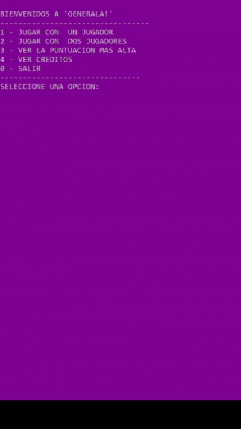

## 🎯 Descripción del Proyecto

Este proyecto consiste en un **juego de dados desarrollado en C++**, diseñado para practicar programación modular, manejo de lógica de juego y uso de herramientas para mejorar la experiencia en consola. El sistema implementa menús interactivos, gestión de puntajes y dos modos de juego completamente funcionales.

---

## 🔧 Características Técnicas Destacadas

- **Arquitectura modular completa**, organizada en múltiples archivos `.cpp` y `.h` que facilitan la mantenibilidad y la futura expansión del proyecto.
- **Lógica de juego sólida**, incluyendo turnos, validaciones, cálculo de puntajes y navegación entre pantallas.
- **Interfaz mejorada en consola** mediante el uso de *rlutil* (colores, posicionamiento del cursor, limpieza de pantalla), creando una experiencia más amigable.
- **Separación clara de responsabilidades**: cada archivo gestiona una parte específica del juego, asegurando organización y claridad en el código.
- **Modos de juego independientes**:  
  - 🧍 *Un Jugador*  
  - 👥 *Dos Jugadores*  
  Cada uno con su propia lógica y administración de puntajes.

---

## 🧩 Puntos Fuertes del Proyecto

- 📁 Estructura modular real con funciones bien distribuidas.  
- 🎮 Flujo completo del juego con menú, turnos y cálculos.  
- 🖥️ Visual atractivo dentro de consola gracias a *rlutil*.  
- 🧼 Código prolijo, ordenado y fácil de entender.  
- 🚀 Ideal como proyecto de portfolio para demostrar conocimientos en C++.

  <b>Demostración del Juego</b> 
  

